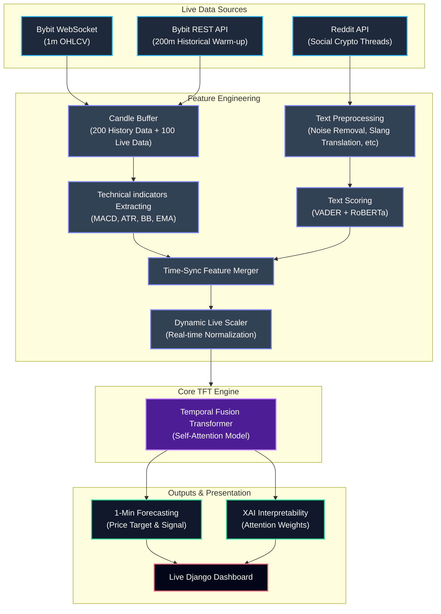

# 🚀 Live 1-Minute Trend Forecasting

A real-time cryptocurrency forecasting system that combines market data (Bybit), social sentiment (Reddit), and Explainable AI (XAI) using the **Temporal Fusion Transformer (TFT)** algorithm.

## 📌 Project Overview
The goal of this project is to provide high-accuracy, 1-minute interval Bitcoin price predictions. It bypasses simple "lagging" indicators by incorporating social sentiment and a sophisticated transformer-based architecture that understands both long-term trends and short-term volatility.

---

## 🏗️ Architecture & Flow


---

## 🧠 Algorithm: Temporal Fusion Transformer (TFT)
The core of this project is the **Temporal Fusion Transformer**, a state-of-the-art multi-horizon forecasting model.

### Why TFT?
- **Variable Selection**: Automatically identifies which features (e.g., MACD vs. Sentiment) are most relevant at any given time.
- **Gated Residual Networks**: Skips unnecessary components of the network depending on the data complexity.
- **Temporal Self-Attention**: Captures long-range dependencies in market cycles.

### Pipeline Execution Steps
1.  **Data Seeding**: Upon startup, the system fetches the last 200 minutes of OHLCV data from Bybit to "warm up" technical indicators.
2.  **Market Pipeline**: A persistent WebSocket connection listens for confirmed 1-minute candles. For each candle, we calculate:
    *   **MACD & Bollinger Bands** (Volatility & Trend)
    *   **ATR** (Real-time risk proxy)
    *   **EMA Reversion** (Mean-reversion signal)
3.  **Sentiment Pipeline**:
    *   **Extraction**: Real-time polling of Reddit search and subreddit streams.
    *   **Preprocessing**: Handles crypto-specific slang (e.g., "HODL" → "Hold"), expands contractions, and filters non-English content.
    *   **Scoring**: Uses **VADER** for lexicon-based sentiment and **RoBERTa** (Transformer) for deep contextual understanding.
4.  **Forecasting Pipeline**:
    *   **Live Scaling**: Dynamically fits a `StandardScaler` to historical data to ensure feature values are in a range the model understands.
    *   **Inference**: Feeds a 120-minute sequence into the TFT model to generate the next minute's fractional return.
    *   **XAI Display**: Extracts attention weights to show the "Top Drivers" (e.g., "RoBERTa influence: 42%").

---

## 🛠️ Technologies Used
- **Language**: Python 3.10+
- **Deep Learning**: PyTorch, PyTorch Forecasting
- **Web UI & Backend**: Django, Tailwind CSS, Chart.js
- **NLP**: Transformers (Hugging Face), NLTK, Fast-Langdetect
- **Data**: Pandas, NumPy, Scikit-Learn

---

## 🚀 Getting Started

### 1. Installation
Install the required dependencies from the virtual environment:
```bash
pip install -r requirements.txt
```

### 2. Execution
The system uses a decoupled architecture to prevent the heavy AI pipeline from lagging the frontend.

**Terminal 1 (ML Pipeline Engine):**
Run the core pipeline to ingest data and output inferences.
```bash
python main.py
```
*Note: This will atomically export data to `dashboard_data.json`.*

**Terminal 2 (Web Dashboard Server):**
Run the modern Tailwind CSS UI server.
```bash
cd btc_dashboard
python manage.py runserver
```

### 3. Monitoring
Open your web browser and navigate to `http://127.0.0.1:8000/`. The real-time Tailwind UI will update to show:
- **Price Trends**: Prediction targets plotted accurately alongside live historical prices, beautifully rendered in Chart.js.
- **Technical Market Extractors**: Live outputs of MACD, ATR, Anomaly flags.
- **NLP Sentiment Analysis**: Tweet volume, VADER, and dynamic RoBERTa multi-stage sentiment bars.
- **Interactive Explainable AI (XAI)**: Clickable, interactive variable importance graphs containing deep explanations for each technical/sentiment feature predicting the sequence.

---

## 📂 Project Structure
- `main.py`: The orchestrator of the live pipeline.
- `tft_model_implementation.py`: Model wrapper and prediction logic.
- `sentiment_analysis.py`: Dual-model NLP processing.
- `technical_analysis.py`: Indicator calculations.
- `fetch_candles.py` & `fetch_tweets.py`: Data ingestion modules.
- `btc_dashboard/`: Django application housing the dashboard UI templates.
- `best_model.ckpt`: Pre-trained TFT weights.
- `scaler.pkl`: Offline data scaler.
